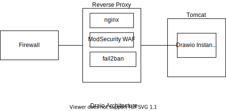

# Puppet Module for diagrams.net (drawio)

This puppet module installs drawio as a Tomcat instance and creates a systemd unit file for management of the application.  It was developed for Debian-family operating systems.

The development repository is located at: <https://gitlab.jaroker.org>.  A mirror repository is pushed to: <https://github.com/jjarokergc/puppet-drawio> for public access.

## Architecture



The module depends on `puppetlabs-java` and `puppetlabs-tomcat` modules.  This module implements its own systemd-based management of the tomcat instance which bypasses the Tomcat scripts (e.g. catalina.sh) in favor of directly running Tomcat in Java.

SSL offloading, caching and security (such as ModSecurity firewall) is provided by an Nginx reverse proxy to the drawio Tomcat instance via an HTTP connector.  The Nginx reverse proxy is not part of this module.

A yaml data file, in the form of Puppet hiera, is used for data lookup, which specifies source location (and version) for downloading, database configuration, nginx configuration and php setup.

 Tested Configuration

* DrawIO 15.7.4, 16.5.3, 16.5.6
* Tomcat 10.0.16
* Java openjdk 11.0.13

## Upgrading

Upgrading is achieved through the yaml file located in either the user-specific `control_repo\data\nodes\[node-name].yaml` or the module-default file `data\common.yaml`.  

Tomcat versions are changed using the configuration parameter `drawio::install[tomcat][version]`.  This will install the requested version and update various settings.

Drawio versions are changed using the configuration parameter `drawio::install[drawio][version]`.  The requested version will be downloaded and unpacked.  The Tomcat instance will point to the new version and the various settings (such as pre- and post-configuration scripts) will be updated and the drawio systemd service restarted.

## Main Requirements

Puppetfile.r10k

``` puppet
mod 'puppetlabs-tomcat', '6.1.0'
mod 'puppetlabs-java', '7.3.0'
```

## Usage Example

An example profile such as `site/role/oss/draw_server.pp` below can be used to configure a server.  The `drawio::install` module is located in the manifests directory.

``` puppet
# Drawio Server
#
class role::app::draw_server{
  include profile::base_configuration

  # Required Packages
  include ::tomcat
  include ::java

  # Diagrams.Net drawio utility
  include drawio::install
  include drawio::config

  # Publically available behind a reverse proxy
   include profile::nginx::reverse_proxy_export

}
```

## Hiera Data Example

data/common.yaml

``` yaml
# draw.example.com
# Module-level defaults
---
# Data Merging Options
# (Over-ride these defaults by using an environment-specific data file)
lookup_options:
  drawio::install:
    merge: hash
  drawio::configure:
    merge: hash

drawio::install:
  tomcat: 
    base: '/opt/tomcat' # Location of binaries
    version: '10.0.16'  # Upgrade tomcat by changing version and url variables
    download_url: 'https://dlcdn.apache.org/tomcat/tomcat-10/v10.0.16/bin/apache-tomcat-10.0.16.tar.gz'
    server_port: '8100'
    temp_dir: '/tmp/tomcat'
  drawio:
    version: '16.5.3'
    package_name: 'draw.war'
    download_url_base: "https://github.com/jgraph/drawio/releases/download"
  instance:
    name: 'draw'        # Subdirectory name
    base: '/var/tomcat' # Server instance location
    max_threads: '400'  # Thread size 

drawio::configure:
  plantuml_url: '' # Disabled if ''.  Example, 'http://plantuml-server:8080/'
  export_url: '/export'  # Image Server Example, http://image-export:8000/
  math_url: 'math'
  csp_header: ''
  viewer: # Either full 'url' if not empty; or, 'path' from drawio base url
    url:  ''                 # Optional.  Either empty or https://example.com. Base_url used if empty.
    path: 'js/viewer.min.js' # Location inside url for viewer file
  lightbox: # Either full 'url' if not empty; or, 'path' from drawio base url
    url:  ''                 # Optional.  Either empty or https://example.com. Base_url used if empty.
    path: 'js/viewer.min.js' # Location inside url for viewer file
  editor_config: ''  # Parameter DRAWIO_CONFIG
  google: # Google drive application id and client id for the editor
    client_id: ''
    app_id:
    client_secret:
    viewer:
      client_id: ''
      app_id:
      client_secret:
  msgraph:
    client_id: ''
    client_secret:
  gitlab:
    id: ''
    url: '' # Gitlab Auth URL
    secret: ''
  cloud_convert_apikey: ''
  iot:
    endpoint: '' # Either null or URL for endpoint
    cert_pem: 
    private_key:
    root_ca: 
    mxpusher_endpoint:
    pusher_mode: 2
  logging: 'true'
#TODO - endpoint cache and real-time collaboration
# - drawio_cache_domain=${drawio_cache_domain}
# - DRAWIO_MEMCACHED_ENDPOINT=${DRAWIO_MEMCACHED_ENDPOINT}
```

data/Debian-family.yaml

```yaml
# Draio Module-level defaults
---
# Data Merging Options
# (Over-ride these defaults by using an environment-specific data file)
lookup_options:
  drawio::provisioning:
    merge: hash

# OS Specific Provisioning
drawio::provisioning:
  systemd_dir: '/etc/systemd/system'
```

## Reverse Proxy

The following is an nginx reference configuration for the reverse proxy (which is not part of this module).

/etc/nginx/sites-enabled/revproxy.draw.example.org.conf

```apacheconf
# MANAGED BY PUPPET
server {
  listen *:80;


  server_name           draw.example.org;
  client_max_body_size 1;


  access_log            /var/log/nginx/revproxy.draw.example.org.access.log;
  error_log             /var/log/nginx/revproxy.draw.example.org.error.log;

  location / {
    return 301 https://$host$request_uri;
  }

  location ~ /\.(?!well-known).* {
    deny all;
    log_not_found on;
    return 404;
  }

  location ^~ /.well-known/acme-challenge/ {
    root      /var/lib/letsencrypt/webroot/;
  }
}
# MANAGED BY PUPPET
server {
  listen       *:443 ssl http2;


  server_name  draw.example.org;

  ssl_certificate           /etc/letsencrypt/live/draw.example.org/fullchain.pem;
  ssl_certificate_key       /etc/letsencrypt/live/draw.example.org/privkey.pem;

  client_max_body_size 1;
  index  index.html index.htm index.php;
  access_log            /var/log/nginx/ssl-revproxy.draw.example.org.access.log;
  error_log             /var/log/nginx/ssl-revproxy.draw.example.org.error.log;


  location ~ /\. {
    limit_req zone=exploit_zone;
    deny all;
    log_not_found on;
    return 404;
  }

  location / {
    modsecurity on;
    modsecurity_rules_file /etc/nginx/modsec/main.conf;
    proxy_pass            http://10.10.10.99:8000;  <<< REQUEST URI?>>>
    proxy_read_timeout    300;
    proxy_connect_timeout 300;
    proxy_send_timeout    90s;
    proxy_redirect        off;
    proxy_http_version    1.1;
    proxy_buffering       off;
    proxy_set_header      Host $host;
    proxy_set_header      X-Real-IP $remote_addr;
    proxy_set_header      X-Forwarded-For $proxy_add_x_forwarded_for;
    proxy_set_header      X-Forwarded-Proto $scheme;
    proxy_set_header      Proxy "";
    proxy_cache           cache_0;
  }
}

```

## Author

Jon Jaroker
devops@jaroker.com
